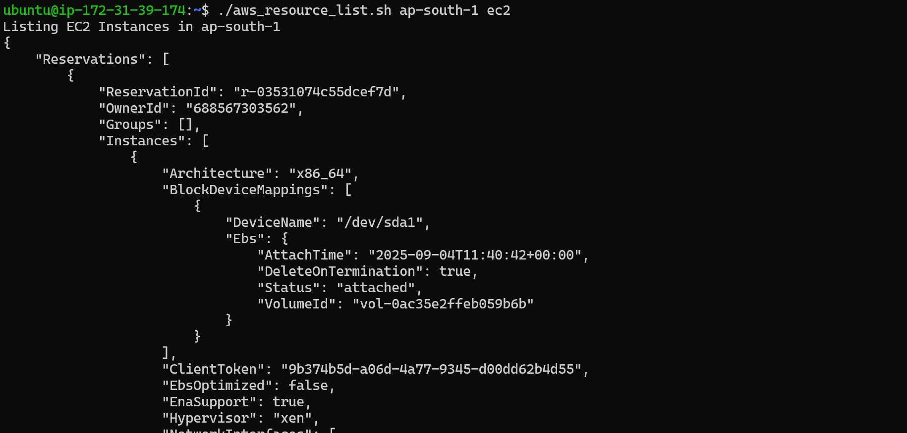
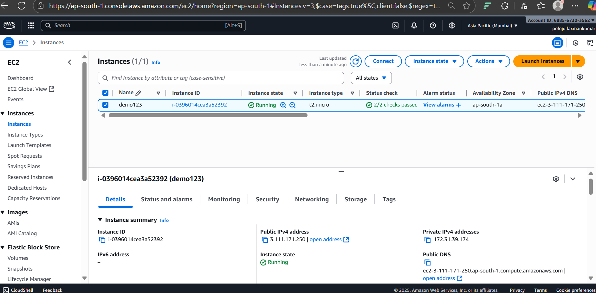
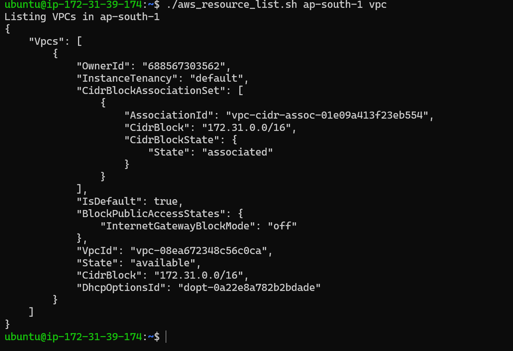
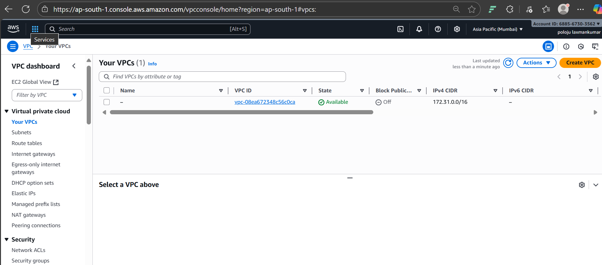
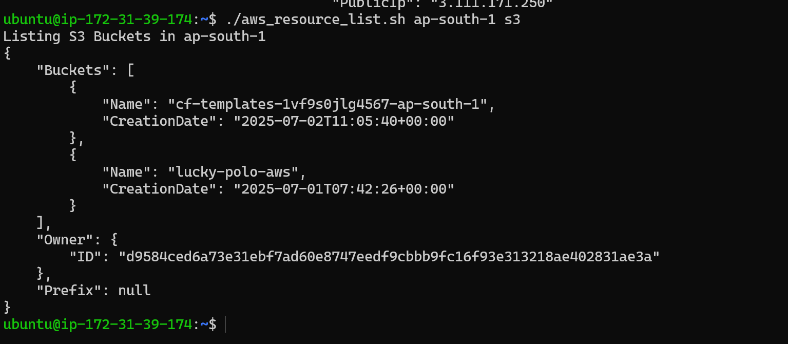
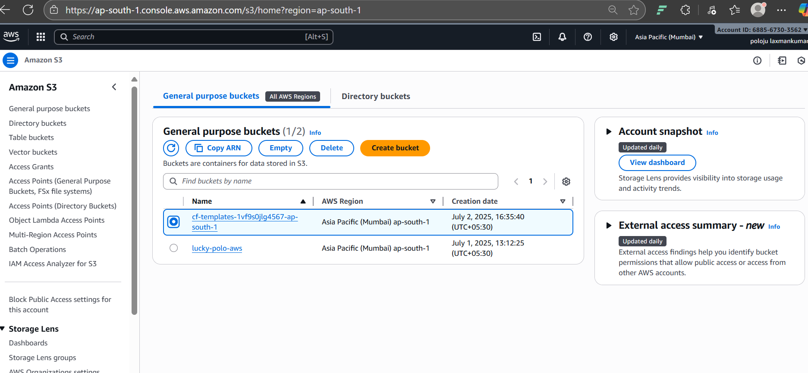

# 🐚 Shell Script Project

This project demonstrates how to use shell scripting to automate tasks in AWS.  
It includes a script to **list AWS resources** and supporting screenshots of the demo.

---

## 📂 Project Files
- `aws_resource_list.sh` → Shell script to list AWS resources in a specific region.  
- `shellscript_project_screenshots/` → Demo screenshots taken during project execution.  

---

## 🚀 How to Run the Script
1. Make the script executable:
   ```bash
   chmod +x aws_resource_list.sh

   # Shell Script Project

This project demonstrates various shell scripts for automation tasks.

## Project Screenshots








